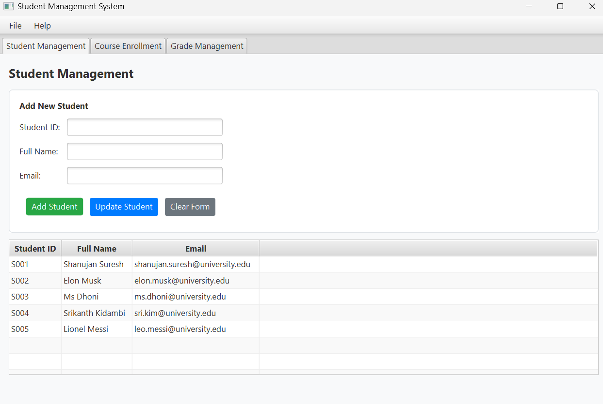
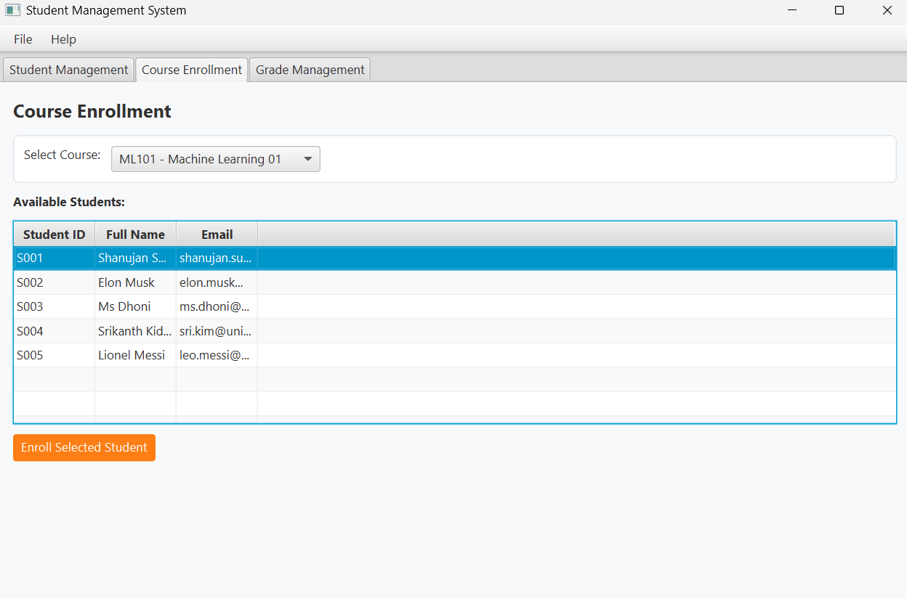
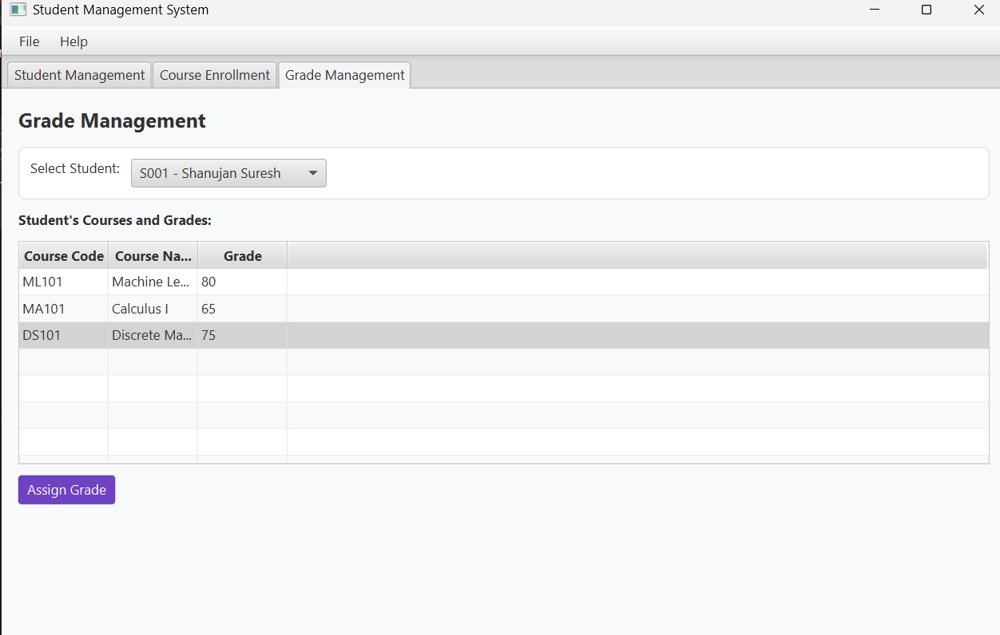

# 🎓 Student Management System

A comprehensive JavaFX application for managing student records, course enrollment, and grade management. Developed as a university assignment demonstrating object-oriented programming and GUI development skills.


## 📋 Table of Contents
- [Features](#-features)
- [Screenshots](#-screenshots)
- [Installation](#-installation)
- [Usage](#-usage)
- [Project Structure](#-project-structure)
- [Technologies Used](#-technologies-used)
- [Contributing](#-contributing)
- [License](#-license)

## ✨ Features

### 🧑‍🎓 Student Management
- ✅ Add new students with validation
- ✅ Update existing student information  
- ✅ View all students in searchable tables
- ✅ Prevent duplicate student IDs

### 📚 Course Enrollment
- ✅ Select from available courses
- ✅ View eligible students for enrollment
- ✅ Enroll students in courses
- ✅ Prevent duplicate enrollments

### 📊 Grade Management
- ✅ Assign and update grades
- ✅ View student's courses and grades
- ✅ Real-time grade updates
- ✅ Professional grade input dialogs

### 🎨 User Experience
- ✅ Modern, intuitive interface
- ✅ Tab-based navigation
- ✅ Real-time data validation
- ✅ Professional error/success messages

## 📸 Screenshots

### Student Management Tab


### Course Enrollment Tab  


### Grade Management Tab


## 🚀 Installation

### Prerequisites
- Java JDK 17 or later
- JavaFX SDK 17

### Step-by-Step Setup

1. **Clone the repository**
   ```bash
   git clone https://github.com/shanujans/StudentManagementSystem.git
   cd StudentManagementSystem
   ```
2. **Install Java JDK 17**
   - Download from [Oracle](https://www.oracle.com/java/technologies/javase/jdk17-archive-downloads.html)
   - Set the `JAVA_HOME` environment variable.

3. **Install JavaFX SDK 17**
   - Download from [Gluon](https://gluonhq.com/products/javafx/)
   - Extract to a location, for example: `C:\Java\javafx-sdk-17.0.2`

4. **Run the application**
   - **Option 1: Using batch file (Windows)**
     ```bash
     run.bat
     ```
   - **Option 2: Manual commands**
     ```bash
     # Compile the application
     javac --module-path "C:\Java\javafx-sdk-17.0.2\lib" --add-modules javafx.controls src/StudentManagementSystem.java

     # Run the application
     java --module-path "C:\Java\javafx-sdk-17.0.2\lib" --add-modules javafx.controls -cp src StudentManagementSystem
     ```

## 💻 Usage

### Adding Students
1. Go to the **Student Management** tab.
2. Fill in the **Student ID**, **Full Name**, and **Email** fields.
3. Click the **"Add Student"** button.
4. The new student will appear in the table below.

### Enrolling in Courses
1. Go to the **Course Enrollment** tab.
2. Select a course from the dropdown menu.
3. Choose a student from the list of available students.
4. Click the **"Enroll Selected Student"** button.

### Assigning Grades
1. Go to the **Grade Management** tab.
2. Select a student from the dropdown menu.
3. Choose a course from the table.
4. Click the **"Assign Grade"** button and enter the grade in the dialog box.

## 🏗️ Project Structure
```text
StudentManagementSystem/
├── src/
│   └── StudentManagementSystem.java  # Main application
├── screenshots/                      # Application screenshots
├── README.md                         # Project documentation
└── run.bat                           # Windows execution script
```

## 🛠️ Technologies Used
- **Java 17** - Programming language
- **JavaFX** - GUI framework
- **Scene Builder** - UI design
- **Git** - Version control

## 📊 Class Diagram
```text
Student Management System
├── Student
│   ├ - id: String
│   ├ - name: String  
│   └ - email: String
├── Course
│   ├ - code: String
│   └ - name: String
└── Enrollment
    ├ - studentId: String
    ├ - courseCode: String
    └ - grade: String
```

## 🔧 Key Features Implemented
- **Event-Driven Programming** - Handling button clicks and user interactions.
- **Data Validation** - Input verification and error handling to ensure data integrity.
- **Dynamic UI Updates** - Real-time changes to the interface based on user actions.
- **Professional GUI** - A modern and user-friendly interface for a better user experience.
- **Data Persistence** - In-memory data management for the application's lifecycle.

## 🤝 Contributing
Contributions are welcome! Please feel free to submit a Pull Request.

1. Fork the project.
2. Create your feature branch (`git checkout -b feature/AmazingFeature`).
3. Commit your changes (`git commit -m 'Add some AmazingFeature'`).
4. Push to the branch (`git push origin feature/AmazingFeature`).
5. Open a Pull Request.

## 📝 License
This project is licensed under the MIT License - see the `LICENSE` file for details.

## 👨‍💻 Developer
- **Shanujan Suresh**
- **Email:** shanujansh@gmail.com

<div align="center">

⭐ Don't forget to star this repository if you find it helpful! ⭐

</div>
